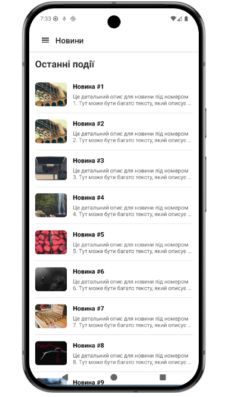
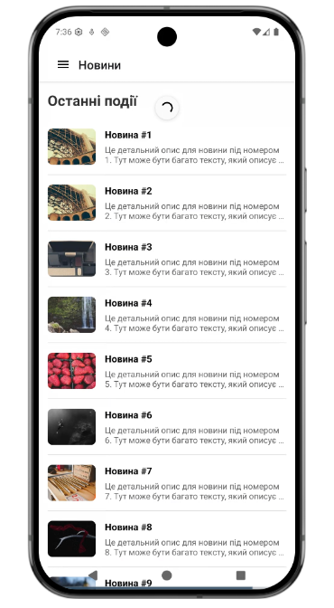
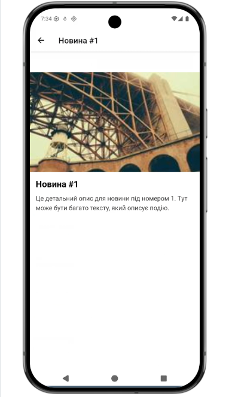
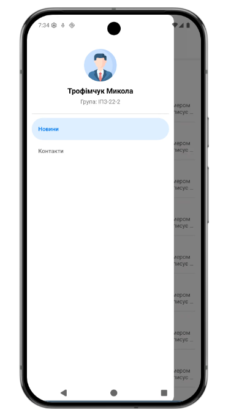
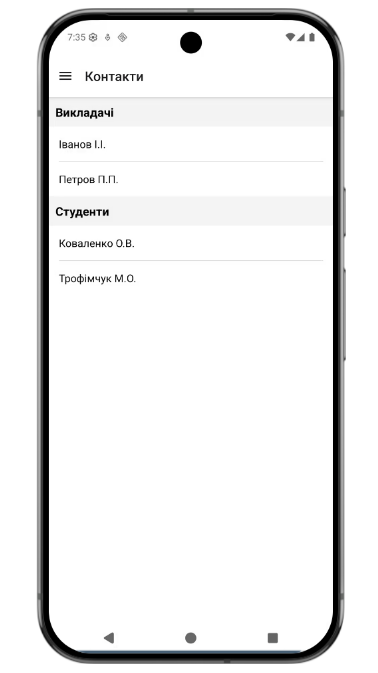

# Лабораторна робота: React Native Навігація та Списки

**Виконав:** Трофімчук Микола 

**Група:** ІПЗ-22-2

Цей проєкт є мобільним застосунком, розробленим за допомогою React Native та Expo. Метою роботи було практичне засвоєння принципів побудови навігації (Drawer та Stack), роботи з віртуалізованими списками (`FlatList`, `SectionList`) та оптимізації рендерингу.

---

## Інструкція із запуску

Щоб запустити проєкт на локальному комп'ютері, виконайте наступні кроки:

1. **Клонуйте репозиторій** (або розпакуйте архів із проєктом):
   ```bash
   git clone

2. **Встановіть залежності проєкту**:

    Переконайтеся, що у вас встановлено Node.js, після чого виконайте команду:

    ```bash
    npm install

3. **Запустіть сервер розробки Expo**:

    ```bash
    npx expo start

4. **Тестування на пристрої**:

    - Завантажте застосунок Expo Go на свій смартфон (з App Store або Google Play).

    - Відскануйте згенерований QR-код у терміналі (або в браузері).

    - Альтернативно: натисніть a для запуску на Android-емуляторі або i для iOS-симулятора (якщо вони налаштовані на вашому ПК).

---

## Опис реалізованого функціоналу
У рамках завдання було реалізовано наступний функціонал:

1. **Екран "Новини" (`MainScreen`):**

    - Побудований на основі компонента `FlatList`.

    - Pull-to-Refresh: реалізовано оновлення списку при свайпі вниз (використано refreshing та onRefresh з імітацією затримки мережі через setTimeout).

    - Infinite Scroll: реалізовано динамічне підвантаження нових елементів при досягненні кінця списку (`onEndReached, onEndReachedThreshold`).

    - Оптимізація: налаштовано параметри `initialNumToRender, maxToRenderPerBatch та windowSize` для економії пам'яті.

    - Використані додаткові компоненти: `ListHeaderComponent, ListFooterComponent` (індикатор завантаження) та ItemSeparatorComponent.


2. **Екран "Деталі новини" (`DetailsScreen`):**

    - Відображає повну інформацію (зображення, текст), передану як параметри з головного екрана.

    - Заголовок екрана (в хедері навігатора) генерується динамічно відповідно до назви обраної новини.


3. **Екран "Контакти" (`ContactsScreen`):**

    - Побудований на основі компонента `SectionList`.

    - Дані структуровані за розділами ("Викладачі", "Студенти"), використовуючи renderSectionHeader для відображення назв груп.


4. **Навігація:**

    - Побудовано вкладену навігацію (`Nested Navigation`).

    - Глобальним навігатором виступає Drawer Navigator (бокове меню).

    - Екран новин обгорнутий у `Stack Navigator`, що дозволяє переходити до деталей новини зі збереженням кнопки "Назад".

    - Усунуто проблему "подвійного хедера" шляхом вимкнення хедера Drawer-а для стеку новин.

    - Кастомізоване Drawer-меню: створено власний компонент, що відображає аватар користувача, ПІБ та групу.

---

## Скріншоти роботи застосунку

    

---

## Висновки (Контрольні запитання)
Під час виконання лабораторної роботи було успішно застосовано механізми маршрутизації та роботи зі списками в React Native. 

**Відповіді на контрольні запитання**:

1. **Чим відрізняється FlatList від ScrollView?** ScrollView рендерить усі свої дочірні елементи одночасно під час завантаження компонента. Це споживає багато ресурсів пристрою (оперативної пам'яті), якщо список великий. FlatList натомість використовує механізм віртуалізації — він рендерить лише ті елементи, які наразі видно на екрані, та кілька елементів про запас. Це робить його значно продуктивнішим для довгих масивів даних.

2. **Що таке віртуалізація списків?** Віртуалізація — це оптимізаційна техніка, яка полягає у відображенні лише видимої частини великого набору даних. Компоненти, які виходять за межі екрана під час скролінгу, видаляються з дерева рендерингу (або перевикористовуються), а на їхньому місці рендеряться нові дані, що з'являються в області видимості. Це дозволяє підтримувати стабільну частоту кадрів (FPS) та низьке споживання пам'яті.

3. **Як здійснюється передача параметрів між екранами?** Параметри передаються об'єктом як другий аргумент у функцію переходу: navigation.navigate('НазваЕкрана', { ключ: значення }). На цільовому екрані ці дані вилучаються з об'єкта route, який передається у пропси компонента, наприклад: const { ключ } = route.params;.

4. **Що таке вкладена навігація?** Вкладена навігація (Nested Navigation) — це патерн, при якому один навігатор (наприклад, Stack) рендериться як екран всередині іншого навігатора (наприклад, Drawer або Tab). Це дозволяє створювати складні ієрархічні структури UI, коли кожен розділ глобального меню має власну незалежну історію переходів.

5. **У яких випадках застосовується SectionList?** SectionList використовується у випадках, коли масив даних має чітку логічну структуру з групуванням за певними ознаками, і ці групи потрібно візуально розділити заголовками. Типові приклади: алфавітний покажчик у телефонній книзі, розклад пар по днях тижня, список налаштувань, згрупований за категоріями (Мережа, Екран, Безпека тощо).