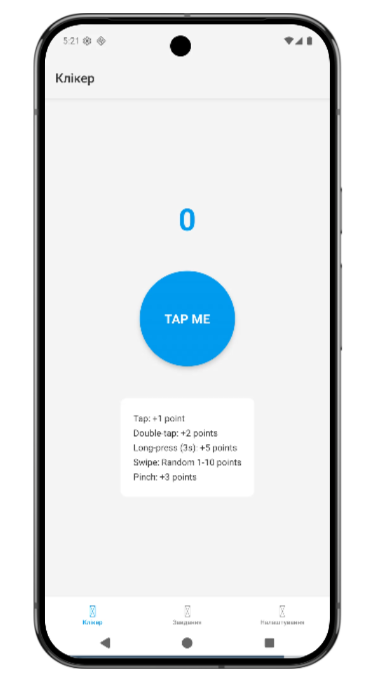
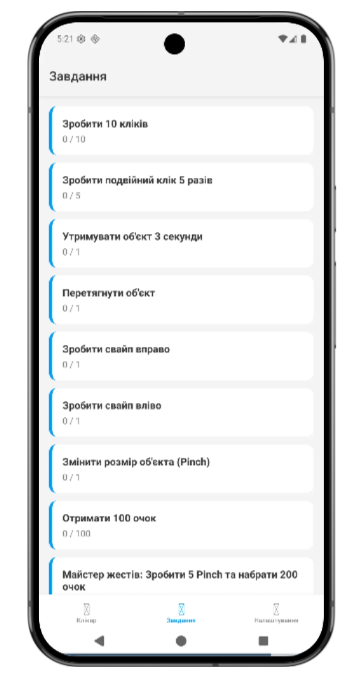
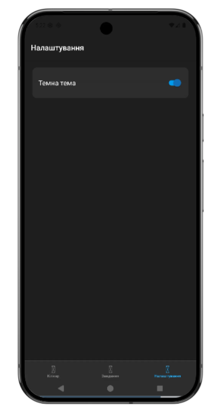

# Лабораторна робота №3. Використання кастомних жестів у React Native та стилізація інтерфейсу

##  Мета роботи
Навчитися працювати з жестами користувача у мобільному застосунку, реалізувати взаємодію через різні типи жестів (Tap, Pan, Pinch, Fling, LongPress) та застосувати сучасні підходи стилізації (Styled Components) у React Native, включаючи підтримку світлої та темної тем.

---

## Опис реалізованого функціоналу

Мобільний додаток являє собою гру-клікер із трьома основними екранами, навігація між якими реалізована за допомогою `@react-navigation/bottom-tabs`. Стан гри (очки, кількість виконаних жестів, поточна тема) керується глобально через `Context API`.

### 1. Головний екран (Клікер)
Реалізовано інтерактивний об'єкт, який реагує на різноманітні жести користувача за допомогою `react-native-gesture-handler` та анімується через `react-native-reanimated`:
* **Single Tap** (`Gesture.Tap`): Додає 1 очко та програє легку анімацію пульсації.
* **Double Tap** (`Gesture.Tap().numberOfTaps(2)`): Додає 2 очки. Жест працює ексклюзивно, не викликаючи звичайний клік.
* **Long Press** (`Gesture.LongPress`): Додає 5 очок за утримання об'єкта протягом 3 секунд.
* **Pan** (`Gesture.Pan`): Дозволяє перетягувати об'єкт по екрану. Після відпускання об'єкт плавно повертається на початкову позицію.
* **Fling** (`Gesture.Fling`): Змахування вправо або вліво додає випадкову кількість очок (від 1 до 10).
* **Pinch** (`Gesture.Pinch`): Масштабування об'єкта двома пальцями додає 3 очки.

### 2. Екран завдань (Челенджі-Завдання)
Відображає список доступних завдань. Прогрес виконання відстежується динамічно:
* Статус кожного завдання оновлюється в реальному часі ("Виконано" або прогрес у цифрах/відсотках).
* Реалізовано власне комплексне завдання: *"Майстер жестів: Зробити 5 Pinch та набрати 200 очок"*, яке вираховує загальний відсоток виконання двох умов одночасно.

### 3. Екран налаштувань
Дозволяє перемикати візуальну тему застосунку (Світла / Темна). Завдяки використанню `styled-components` та `ThemeProvider`, зміна теми миттєво застосовується до всіх компонентів на всіх екранах без необхідності перезавантаження.

---

## Інструкція запуску

Застосунок можна запустити локально за допомогою Expo CLI або переглянути у веб-середовищі Expo Snack.

### Локальний запуск:
1. Переконайтеся, що на вашому комп'ютері встановлено [Node.js](https://nodejs.org/).
2. Клонуйте репозиторій або розпакуйте архів із проєктом.
3. Відкрийте термінал у папці проєкту та встановіть залежності:
   ```bash
   npm install
   
4. Запустіть проєкт:
   ````bash
   npx expo start

5. Для тестування на реальному пристрої встановіть додаток Expo Go (Android/iOS) та відскануйте QR-код з терміналу.

### Запуск через Expo Snack (Альтернатива):
1. Відкрийте середовище Expo Snack. 
2. Імпортуйте файли проєкту. 
3. Оберіть вкладку "My Device" для тестування жестів (Pinch, Fling) на реальному смартфоні за допомогою додатка Expo Go, оскільки веб-емулятор не підтримує мультитач-жести.

---

## Скріншоти роботи застосунку
| Головний екран | Екран завдань | Налаштування <br/>(Темна тема) |
|:---:|:---:|:---:|
|  |  |  |

---

## Висновки
_В ході виконання лабораторної роботи було успішно розроблено мобільний застосунок **"Clicker"**._

**Основні здобутки:**

1. Опановано роботу з бібліотекою react-native-gesture-handler. Налаштовано розпізнавання як простих (Tap), так і складних мультитач жестів (Pinch, Pan, Fling). 
2. Реалізовано комбінування жестів (Exclusive, Simultaneous), що дозволило уникнути конфліктів між одинарним та подвійним кліком, а також дозволило розпізнавати жести одночасно. 
3. Закріплено навички роботи з react-native-reanimated для створення плавних анімацій при взаємодії з UI-елементами (пружинні ефекти, масштабування). 
4. Побудовано архітектуру глобального стану за допомогою Context API для синхронізації прогресу між екраном клікера та екраном завдань.
5. Застосовано бібліотеку styled-components для ізольованої стилізації компонентів та безшовної імплементації глобальної темної/світлої теми застосунку.

**Завдання лабораторної роботи виконано в повному обсязі.**