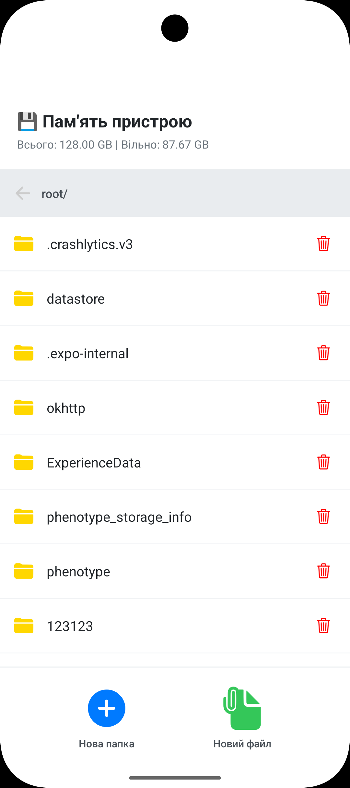
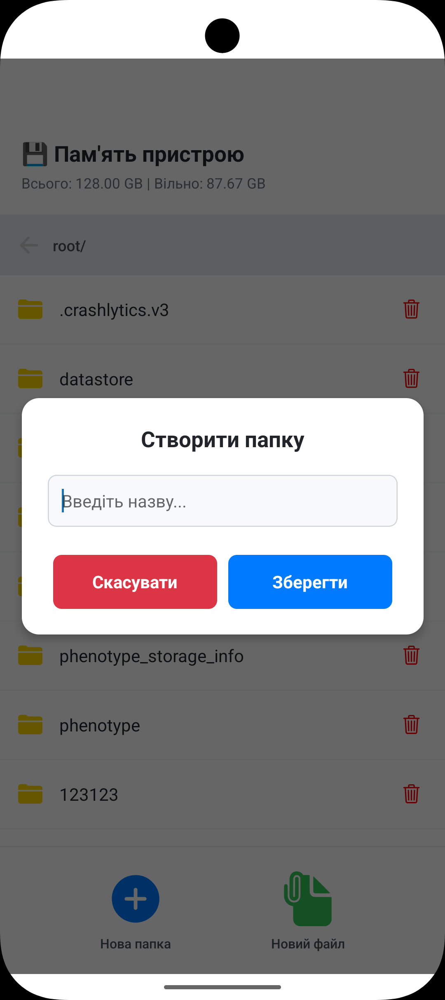
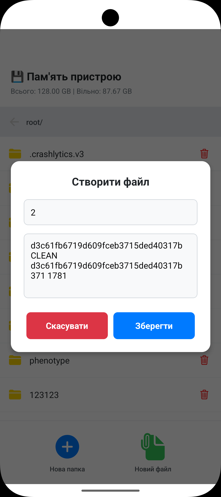
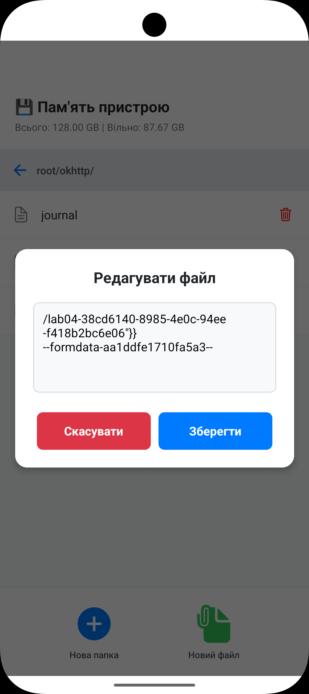

# Мобільний застосунок «Файловий менеджер»

Цей проєкт є лабораторною роботою студента 4-го курсу Житомирської політехніки.  
Застосунок реалізований на базі **React Native** з використанням **Expo SDK** та призначений для управління локальною файловою системою мобільного пристрою.

---

## Мета роботи

Опанувати механізми роботи з локальною файловою системою мобільного пристрою за допомогою бібліотеки **expo-file-system**, а також реалізувати базові операції над файлами і папками.

---

## Інструкція із запуску

### Попередні вимоги

- Встановлений **Node.js** (LTS версія)
- Встановлений **Expo CLI**
- Встановлений **Android Studio** з емулятором  
  (рекомендовано **Pixel 9 API 37.0**)  
  **або** застосунок **Expo Go** на смартфоні

---

### ▶Кроки для запуску

1. **Створення проєкту та перехід у директорію**
   ```bash
   npx create-expo-app FileManagerProject
   cd FileManagerProject
   
2. Встановлення залежностей
    ```bash
    npx expo install expo-file-system react-native-safe-area-context @expo/vector-icons
   
3. Запуск сервера розробки
    ```bash
   npx expo start
   
4. апуск на Android емуляторі
   - Натисніть a у терміналі
   або відкрийте через Android Studio

---

## Опис функціоналу

Застосунок реалізує повний цикл управління файлами (CRUD) у локальному сховищі.

1. Навігація по файловій системі
   - Відображення поточного шляху (breadcrumb)
   - Перегляд вмісту директорії (файли та папки)
   - Перехід у вкладені папки 
   - Перехід "вгору" до попередньої директорії

2. Створення
   - Створення нових папок 
   - Створення текстових файлів .txt 
   - Додавання початкового вмісту файлу

3. Зчитування
   - Відкриття .txt файлів
   - Перегляд вмісту файлу

4. Редагування
   - Редагування текстових файлів
   - Збереження змін у файл

5. Видалення
   - Видалення файлів і папок
   - Підтвердження дії через системне вікно (Alert)

6. Інформація про файл

    Відображаються наступні атрибути:

- Назва файлу
- Тип (файл / папка)
- Розмір (у байтах)
- Дата останньої модифікації

7. Статистика памʼяті

    На головному екрані відображається:

   - Загальний обсяг памʼяті 
   - Вільний простір 
   - Зайнятий простір

### Використані технології
- React Native 
- Expo SDK 
- expo-file-system 
- React Hooks (useState, useEffect)
- FlatList — для відображення списків 
- Modal + TextInput — для введення даних

---

## Скріншоти роботи застосунку
|                 Головний екран                 |                                         Створення папки / файлу                                          |                 Редагування файлу                  |
|:----------------------------------------------:|:--------------------------------------------------------------------------------------------------------:|:--------------------------------------------------:|
|  |   |  |

---

## Особливості реалізації
- Асинхронна робота з файловою системою 
- Динамічне оновлення списку файлів 
- Простий та зрозумілий інтерфейс 
- Підтримка сучасних екранів (Safe Area)

## Висновок

У ході виконання лабораторної роботи було реалізовано мобільний застосунок для роботи з файловою системою, який підтримує:

навігацію між папками
створення файлів і директорій
редагування текстових файлів
видалення об'єктів
перегляд інформації про файли
аналіз використання памʼяті

Отримано практичні навички роботи з файловою системою в середовищі React Native + Expo.