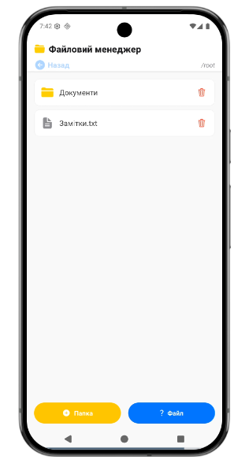
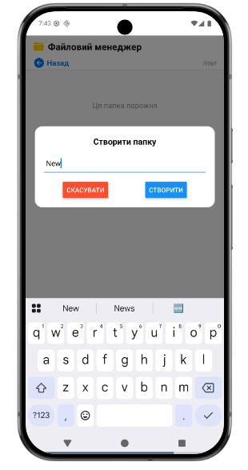
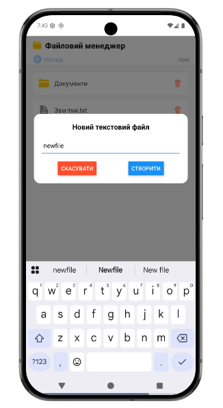
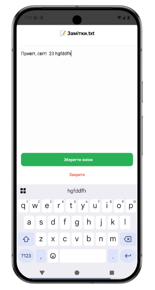

# Mobile File Manager (React Native + Expo)

Мобільний застосунок для керування локальною файловою системою пристрою.  
Розроблений як навчальний проект для опанування роботи з `expo-file-system` та побудови адаптивних інтерфейсів у React Native.

---

## Опис функціоналу

Застосунок реалізує повний цикл керування файлами та папками:

### Навігація
- Перегляд вмісту директорій у вигляді списку (`FlatList`)
- Перехід у вкладені папки
- Повернення "вгору" (Breadcrumbs)
- Відображення поточного шляху

### Робота з файлами
- **Створення:** нових папок і текстових файлів (`.txt`)
- **Читання:** відкриття файлів у редакторі
- **Редагування:** зміна вмісту файлів із збереженням
- **Видалення:** з підтвердженням через `Alert`

### Інформація та статистика
- Деталі файлу:
    - назва
    - тип
    - розмір (байти)
    - дата зміни
- Моніторинг пам’яті:
    - загальний обсяг
    - використано
    - вільно

### Адаптивний дизайн
- Використання `SafeAreaView`
- Підтримка пристроїв із вирізами (Notch)
- Коректне відображення UI

---

## Інструкція із запуску

### Варіант 1: Expo Snack (Online)

1. Відкрийте **Expo Snack**
2. Вставте код у `App.js`
3. Додайте залежності:

    ```json
    {
      "dependencies": {
        "expo-file-system": "*",
        "react-native-safe-area-context": "*",
        "@expo/vector-icons": "*"
      }
    }
   
4. Запустіть:

   - через емулятор 
   - або через Expo Go (QR-код)

   - Локально:
   ```
     git clone https://github.com/your-username/file-manager-react-native.git
     cd file-manager-react-native
     npm install
     npx expo start

---

## Скріншоти роботи застосунку
|              Головний екран               |                                    Створення папки / файлу                                     |               Редагування файлу               |
|:-----------------------------------------:|:----------------------------------------------------------------------------------------------:|:---------------------------------------------:|
|  |   |  |

---

## Технологічний стек

- **Framework:** React Native (Expo)
- **File System:** expo-file-system 
- **Icons:** @expo/vector-icons (Ionicons)
- **UI:** react-native-safe-area-context