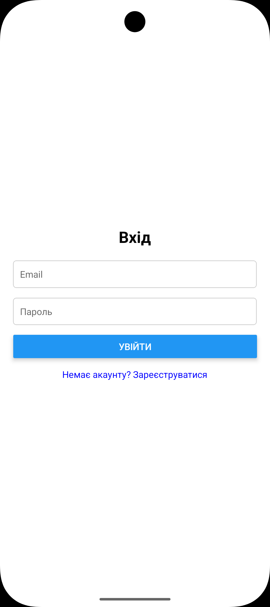
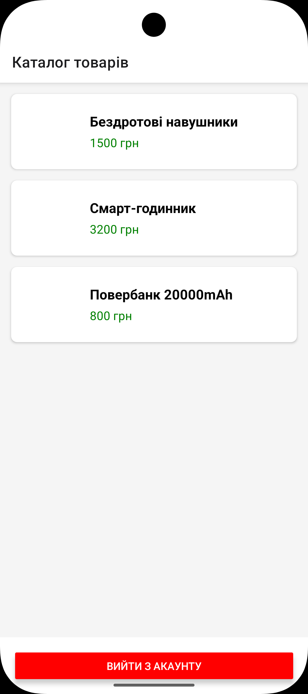

# Лабораторна робота №5: Навігація в React Native через Expo Router

Даний проєкт демонструє побудову сучасної навігації в мобільному застосунку з використанням концепції **File-based routing**, захищених маршрутів та глобального контексту авторизації.

## Інструкція із запуску

1. **Встановлення залежностей**:
   Переконайтеся, що ви знаходитесь у корені проєкту `lab05` та виконайте:
   ```bash
   npm install
   # або якщо використовуєте expo
   npx expo install expo-router react-native-safe-area-context react-native-screens expo-linking expo-constants expo-status-bar
   
2. **Запуск сервера:**
    ```bash
   npx expo start -c
   
3. Запуск на Android:
   Натисніть клавішу a у терміналі (переконайтеся, що емулятор Android Studio запущений).

---

## Опис функціоналу
- Авторизація (React Context): Реалізовано глобальний стан користувача, що дозволяє входити та виходити з системи.

- Захищені маршрути: Група (app) доступна лише після входу. Спроба доступу до каталогу без логіну автоматично перенаправляє на сторінку входу.

- Каталог товарів: Список товарів, згенерований на основі тестових даних, відображається за допомогою FlatList.

- Динамічна навігація: Перехід на сторінку детальної інформації про товар реалізовано через маршрут app/(app)/details/[id].jsx.

- Обробка помилок: Налаштована сторінка +not-found.jsx для неіснуючих адрес.

---

## Скріншоти

|                                            Екран входу                                             |                  Каталог тоарів                   |                  Сторінка товару                  |
|:--------------------------------------------------------------------------------------------------:|:-------------------------------------------------:|:-------------------------------------------------:|
|   |  |  |

---

## Висновки (Відповіді на контрольні запитання)

1. Реалізація перенаправлення: Використовується компонент <Redirect /> у макеті захищеної групи app/(app)/_layout.jsx на основі перевірки стану з AuthContext.

2. Link vs router.push(): <Link> — декларативний компонент для переходів у розмітці. router.push() — метод для програмного переходу в логіці функцій.

3. Динамічні маршрути: Створюються файлами типу [id].jsx. Параметри зчитуються хуком useLocalSearchParams().

4. Глобальний контекст: Доцільний, оскільки дані про авторизацію потрібні одночасно в багатьох незалежних компонентах та для логіки редіректів у Layout-файлах.

5. Групи маршрутів: Дозволяють логічно розділяти код та створювати незалежні макети. Вони не відображаються в URL-адресі, що робить структуру чистішою.