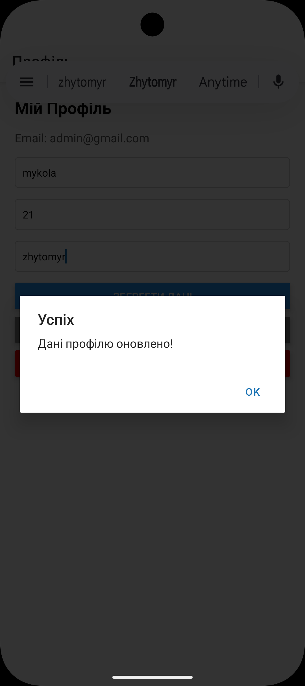

# Лабораторна робота №6
## Тема: Побудова авторизації та збереження персональних даних у React Native з використанням Firebase

Даний проєкт реалізує систему автентифікації користувачів та хмарне сховище для профілів користувачів. Основний акцент зроблено на безпеці даних та інтеграції з сервісами Google Firebase.

---

## Інструкція із запуску

1. **Запуск сервера:**
    ```bash
   npx expo start -c

2. Запуск на Android:
   Натисніть клавішу a у терміналі (переконайтеся, що емулятор Android Studio запущений).

---

## Реалізований функціонал
1. Firebase Authentication:

   - Реєстрація (Sign Up) з валідацією полів.

   - Вхід (Log In) та вихід (Log Out).

   - Відновлення пароля через електронну пошту.

2. Cloud Firestore:

    - Створення документа користувача при реєстрації.

    - Читання та редагування персональних даних (Ім'я, Вік, Місто).

    - Автоматичне оновлення інтерфейсу при зміні даних.

3. Безпека (Security):

    - Використання Redirect для захисту (app) групи від неавторизованих осіб.

    - Повторна автентифікація перед видаленням акаунту (Re-authentication).

    - Серверні правила доступу, що забороняють доступ до чужих профілів.

---

## Структура проєкту

- app/ — файлова маршрутизація (Expo Router).

    - (auth)/ — публічні екрани (Login, Register, Reset).

    - (app)/ — захищений екран профілю.

    - _layout.jsx — кореневий провайдер контексту.
- config/ — конфігурація Firebase SDK.

- context/ — AuthContext для управління станом користувача.

---

## Скріншоти роботи

|                                            Екран входу                                             |                                   Профіль користувача  - Зміна даних                                   |                 Відновлення паролю                  |
|:--------------------------------------------------------------------------------------------------:|:------------------------------------------------------------------------------------------------------:|:---------------------------------------------------:|
|   |   |  |

---

## Висновки (Відповіді на контрольні запитання)
1. Яким чином за допомогою Expo Router реалізується перенаправлення неавторизованого користувача?
   Перенаправлення (редірект) зазвичай реалізується декларативно у файлі макета (наприклад, _layout.jsx) захищеної групи маршрутів. Програма перевіряє стан авторизації (отриманий, наприклад, з контексту). Якщо користувач не авторизований, замість екранів додатка повертається спеціальний компонент <Redirect href="/login" />, який миттєво перекидає користувача на сторінку входу.
2. У чому полягає різниця між використанням компонента <Link> та метода router.push()?

    - *<Link> — це декларативний підхід (аналог тегу <a> у HTML). Він використовується безпосередньо у розмітці (JSX) для створення клікабельних елементів навігації. Це кращий вибір для статичних переходів, оскільки він підтримує доступність (accessibility) та стандартну поведінку платформи.

    - router.push() — це імперативний підхід. Цей метод викликається програмно всередині функцій або обробників подій (наприклад, onPress). Його використовують, коли перехід має відбутися після виконання якоїсь логіки — наприклад, після успішної перевірки пароля або збереження даних у базу.
3. Як працюють динамічні маршрути в Expo Router і як отримати передані параметри?
   Динамічні маршрути створюються шляхом використання квадратних дужок у назві файлу або папки, наприклад, [id].jsx. Це вказує роутеру, що ця частина шляху є змінною.
   Щоб отримати значення цього параметра на самому екрані, використовується спеціальний хук useLocalSearchParams(). Наприклад, якщо шлях /details/42, то const { id } = useLocalSearchParams(); запише значення 42 у змінну id.
4. Чому стан авторизації доцільно зберігати у глобальному контексті (React Context), а не в локальному стані компонента?
   Стан авторизації є "наскрізним" (глобальним) для всього застосунку. Інформація про те, чи увійшов користувач, і які його дані (наприклад, ім'я або uid), потрібна одночасно у багатьох місцях:

    - У _layout.jsx для захисту маршрутів.

    - У шапці навігації (Header) для відображення кнопки "Вийти" або аватара.

    - На сторінці профілю.
   
   Якби ми використовували локальний стан (useState в App.js), нам довелося б передавати ці дані через пропси кожному дочірньому компоненту (це називається prop drilling), що робить код заплутаним і важким для підтримки. React Context дозволяє "транслювати" ці дані і отримувати до них доступ з будь-якого компонента безпосередньо.
5. Для чого використовуються групи маршрутів (folderName) і як вони впливають на URL-адресу?
   Групи маршрутів створюються за допомогою круглих дужок у назві папки, наприклад (auth) або (app).

    - Для чого: Вони дозволяють логічно організувати файли проєкту та, найголовніше, створювати окремі, незалежні макети (_layout.jsx) для різних частин застосунку (наприклад, один макет для екранів реєстрації/входу, а інший — для основного додатка з нижньою панеллю навігації).

    - Вплив на URL: Їхня ключова властивість полягає в тому, що назва групи повністю ігнорується під час формування URL-адреси. Тобто файл, який лежить за шляхом app/(auth)/login.jsx, буде доступний за короткою та чистою адресою /login.